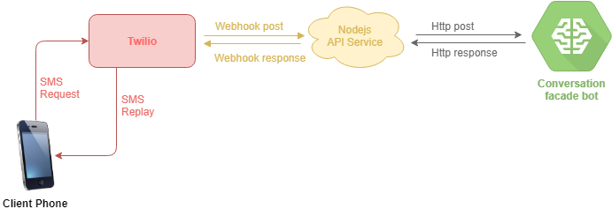
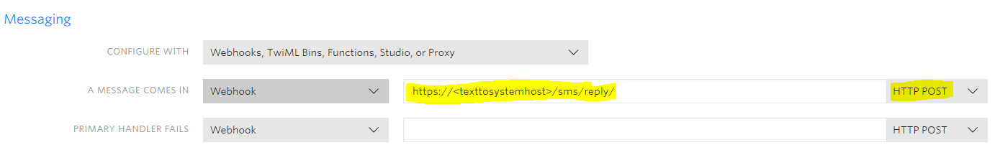
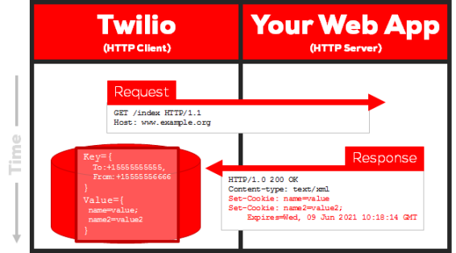
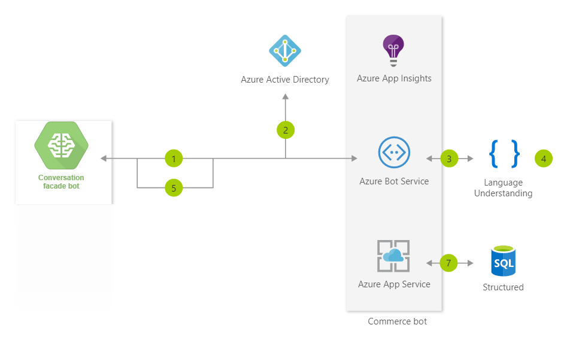

# Text to system

Text to system is a customer driven conversation system, it accept text messages (SMS) as a request and pass it to a fully automated service bot hosted in azure and with its contextual language understanding it can create conversational interfaces for various scenarios like banking, travel, and entertainment purposes, in this example I use the same concept to create ecomrece bot for as a customer ordering system.

## System design

Text to system contains 3 main components:

- Twillio: the SMS cloud service
- API service: nodejs back end that is hooked to Twillio using Webhook
- Conversation facade: .net service that connect to azure Chatbot

This components interact with each other as shown in the diagram below

## Twillio configuration

Twillio is the SMS cloud service used to orchestrate the end user requests to the nodejs back end system

This is done by creating a Webhook between Twillio and nodejs as shown below

The nodejs back end will receive all required information regarding the end user request

## Conversation facade bot

The conversation facade bot is an implementation of azure chatbot using the standard `Commerce Chatbot` model as shown below

1. Conversation facade bot connect to azure
2. Using Azure AD B2C, the Conversation facade authenticates
3. Using the custom Application Bot, user requests information
4. Cognitive Services helps process the natural language request
5. Response is reviewed by customer who can refine the question using natural conversation
6. Once the end user is happy with the results, the Application Bot updates the users requests
7. Application insights gathers runtime telemetry to help development with Bot performance and usage

